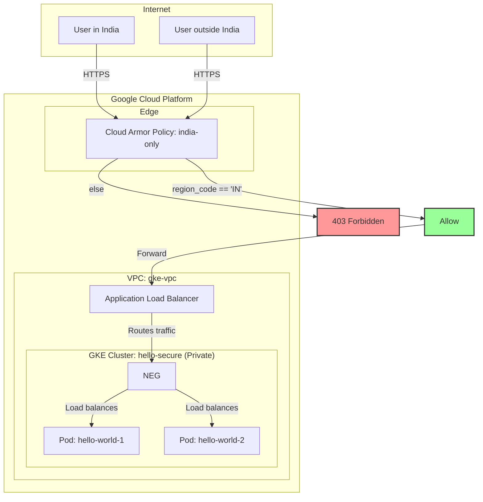

# Deploying a secure hello-world app on GKE

## Table of Contents

- [Deploying a secure hello-world app on GKE](#deploying-a-secure-hello-world-app-on-gke)
  - [What we're building](#what-were-building)
  - [Prerequisites](#prerequisites)
  - [Phase 0 — Install tools (do this once)](#phase-0--install-tools-do-this-once)
  - [Phase 1 — GCP project setup](#phase-1--gcp-project-setup)
  - [Phase 2 — VPC and networking](#phase-2--vpc-and-networking)
  - [Phase 3 — Create the private GKE cluster](#phase-3--create-the-private-gke-cluster)
  - [Phase 4 — Access the private cluster via a bastion host](#phase-4--access-the-private-cluster-via-a-bastion-host)
  - [Phase 5 — Workload Identity setup](#phase-5--workload-identity-setup)
  - [Phase 6 — Apply Pod Security Standards](#phase-6--apply-pod-security-standards)
  - [Phase 7 — RBAC](#phase-7--rbac)
  - [Phase 8 — Deploy the hello-world app](#phase-8--deploy-the-hello-world-app)
  - [Phase 9 — Cloud Armor: India-only geo-restriction](#phase-9--cloud-armor-india-only-geo-restriction)
  - [Phase 10 — Ingress (GCP Application Load Balancer)](#phase-10--ingress-gcp-application-load-balancer)
  - [Phase 11 — Verify everything](#phase-11--verify-everything)
  - [Phase 12 — Cleanup (important — stop billing)](#phase-12--cleanup-important--stop-billing)
  - [What you've built](#what-youve-built)
  - [Common errors and fixes](#common-errors-and-fixes)

**What we're building:** A hello-world container, running on a private GKE cluster in Mumbai (`asia-south1`), accessible only from India, with Workload Identity, RBAC, and Pod Security Standards applied.

**Prerequisites:** A GCP account with free credits, a Mac, and about 45 minutes.

---

## Phase 0 — Install tools (do this once)

```bash
# 1. Install Google Cloud CLI
brew install --cask google-cloud-sdk

# 2. Install kubectl and GKE auth plugin
gcloud components install kubectl gke-gcloud-auth-plugin

# 3. Log in
gcloud auth login
gcloud auth application-default login
```

---

## Phase 1 — GCP project setup

```bash
# Create a new project (or use existing one)
gcloud projects create gke-secure-demo --name="GKE Secure Demo"
gcloud config set project gke-secure-demo

# Link billing account (required even for free credits)
# Find your billing account ID:
gcloud billing accounts list

# Link it:
gcloud billing projects link gke-secure-demo \
  --billing-account=XXXXXXX-XXXXXXX-XXXXXXX

# Enable required APIs
gcloud services enable \
  container.googleapis.com \
  compute.googleapis.com \
  artifactregistry.googleapis.com \
  cloudarmor.googleapis.com \
  iamcredentials.googleapis.com \
  secretmanager.googleapis.com

# Set default region
gcloud config set compute/region asia-south1
gcloud config set compute/zone asia-south1-a
```

---

## Phase 2 — VPC and networking

We need a custom VPC with secondary ranges for VPC-native pod and service IPs.

```bash
# Create VPC
gcloud compute networks create gke-vpc \
  --subnet-mode custom

# Create subnet with secondary ranges for pods and services
gcloud compute networks subnets create gke-subnet \
  --network gke-vpc \
  --region asia-south1 \
  --range 10.0.1.0/24 \
  --secondary-range pods=10.4.0.0/14,services=10.8.0.0/20

# Cloud Router (needed for Cloud NAT)
gcloud compute routers create gke-router \
  --network gke-vpc \
  --region asia-south1

# Cloud NAT — allows pods to pull images without public IPs
gcloud compute routers nats create gke-nat \
  --router gke-router \
  --region asia-south1 \
  --auto-allocate-nat-external-ips \
  --nat-all-subnet-ip-ranges
```

---

## Phase 3 — Create the private GKE cluster

This is the most important command. Take a moment to read each flag.

```bash
gcloud container clusters create hello-secure \
  --region asia-south1 \
  --network gke-vpc \
  --subnetwork gke-subnet \
  --cluster-secondary-range-name pods \
  --services-secondary-range-name services \
  \
  --enable-private-nodes \
  --enable-private-endpoint \
  --master-ipv4-cidr 172.16.0.0/28 \
  \
  --workload-pool=gke-secure-demo.svc.id.goog \
  \
  --enable-ip-alias \
  --enable-dataplane-v2 \
  \
  --num-nodes 1 \
  --machine-type e2-medium \
  \
  --release-channel regular

# This takes 5-8 minutes. Get a coffee.
```

**What each security flag does:**

| Flag | What it does |
|------|-------------|
| `--enable-private-nodes` | Nodes get no public IPs |
| `--enable-private-endpoint` | Control plane reachable only via private IP |
| `--master-ipv4-cidr` | CIDR for the control plane VPC peering |
| `--workload-pool` | Enables Workload Identity for the cluster |
| `--enable-dataplane-v2` | eBPF instead of iptables — needed for NetworkPolicy |

---

## Phase 4 — Access the private cluster via a bastion host

Because the cluster has a private endpoint, `kubectl` commands from your local machine won't work directly. You need a bastion host (a small VM inside the VPC) to act as a secure proxy. We'll use IAP (Identity-Aware Proxy) to connect to the bastion without exposing it to the public internet.

```bash
# 1. Create a small bastion VM inside the VPC
gcloud compute instances create gke-bastion \
  --zone asia-south1-a \
  --machine-type e2-micro \
  --network gke-vpc \
  --subnet gke-subnet \
  --no-address \
  --scopes cloud-platform

# 2. Allow IAP to reach the bastion for SSH
gcloud compute firewall-rules create allow-iap-ssh \
  --network gke-vpc \
  --allow tcp:22 \
  --source-ranges 35.235.240.0/20 # This is the IP range for IAP

# 3. Get credentials, pointing kubectl at the private endpoint
gcloud container clusters get-credentials hello-secure \
  --region asia-south1 \
  --internal-ip

# 4. Open an IAP tunnel in one terminal (keep it running)
# This command forwards a local port (8888) to the GKE master's private IP and port (443)
# via the bastion host.
gcloud compute ssh gke-bastion \
  --zone asia-south1-a \
  --tunnel-through-iap \
  -- -L 8888:$(gcloud container clusters describe hello-secure \
       --region asia-south1 \
       --format='get(privateClusterConfig.privateEndpoint)'):443 \
  -N -q

# 5. In another terminal, point kubectl at the local tunnel
# We use --insecure-skip-tls-verify because we're connecting to 127.0.0.1,
# and the certificate is for the GKE master's IP.
kubectl config set-cluster $(kubectl config current-context) \
  --server=https://127.0.0.1:8888 \
  --insecure-skip-tls-verify=true

# Now kubectl works through the tunnel
kubectl get nodes
# Should show the nodes in your cluster
```

> **Tip for simpler access:** For development or learning, you can temporarily enable the public endpoint on the cluster (`gcloud container clusters update hello-secure --enable-master-authorized-networks --master-authorized-networks YOUR_IP/32`). This is less secure but avoids the need for a bastion. Remember to disable it for production.

---

## Phase 5 — Workload Identity setup

```bash
# 1. Create a GCP Service Account for the app
gcloud iam service-accounts create hello-app-sa \
  --display-name "Hello App Service Account"

# 2. Grant it only what it needs
#    (Artifact Registry reader — to pull its own image)
gcloud projects add-iam-policy-binding gke-secure-demo \
  --member "serviceAccount:hello-app-sa@gke-secure-demo.iam.gserviceaccount.com" \
  --role "roles/artifactregistry.reader"

# 3. Create a Kubernetes namespace and service account
kubectl create namespace hello

kubectl create serviceaccount hello-ksa \
  --namespace hello

# 4. Annotate the KSA to link it to the GCP SA
kubectl annotate serviceaccount hello-ksa \
  --namespace hello \
  iam.gke.io/gcp-service-account=hello-app-sa@gke-secure-demo.iam.gserviceaccount.com

# 5. Grant the GCP SA permission to impersonate via Workload Identity
gcloud iam service-accounts add-iam-policy-binding \
  hello-app-sa@gke-secure-demo.iam.gserviceaccount.com \
  --role roles/iam.workloadIdentityUser \
  --member "serviceAccount:gke-secure-demo.svc.id.goog[hello/hello-ksa]"
```

---

## Phase 6 — Apply Pod Security Standards

Label the namespace to enforce the `restricted` policy. This blocks privileged containers, host networking, and forces non-root execution.

```bash
kubectl label namespace hello \
  pod-security.kubernetes.io/enforce=restricted \
  pod-security.kubernetes.io/enforce-version=latest \
  pod-security.kubernetes.io/warn=restricted \
  pod-security.kubernetes.io/audit=restricted
```

---

## Phase 7 — RBAC

Create a minimal Role for the hello-ksa service account — it only needs to read its own ConfigMap.

```yaml
# Save as rbac.yaml
apiVersion: rbac.authorization.k8s.io/v1
kind: Role
metadata:
  namespace: hello
  name: hello-role
rules:
- apiGroups: [""]
  resources: ["configmaps"]
  verbs: ["get", "list"]
---
apiVersion: rbac.authorization.k8s.io/v1
kind: RoleBinding
metadata:
  name: hello-rolebinding
  namespace: hello
subjects:
- kind: ServiceAccount
  name: hello-ksa
  namespace: hello
roleRef:
  kind: Role
  name: hello-role
  apiGroup: rbac.authorization.k8s.io
```

```bash
kubectl apply -f rbac.yaml
```

---

## Phase 8 — Deploy the hello-world app

This manifest is written to pass Pod Security Standards — non-root, read-only filesystem, no privilege escalation, explicit security context.

```yaml
# Save as hello-deploy.yaml
apiVersion: apps/v1
kind: Deployment
metadata:
  name: hello-world
  namespace: hello
spec:
  replicas: 2
  selector:
    matchLabels:
      app: hello-world
  template:
    metadata:
      labels:
        app: hello-world
    spec:
      serviceAccountName: hello-ksa

      securityContext:
        runAsNonRoot: true
        runAsUser: 1000
        seccompProfile:
          type: RuntimeDefault

      containers:
      - name: hello
        image: us-docker.pkg.dev/google-samples/containers/gke/hello-app:1.0
        ports:
        - containerPort: 8080

        securityContext:
          allowPrivilegeEscalation: false
          readOnlyRootFilesystem: true
          capabilities:
            drop: ["ALL"]

        resources:
          requests:
            cpu: "50m"
            memory: "64Mi"
          limits:
            cpu: "200m"
            memory: "128Mi"
---
apiVersion: v1
kind: Service
metadata:
  name: hello-service
  namespace: hello
  annotations:
    cloud.google.com/neg: '{"ingress": true}'
    cloud.google.com/backend-config: '{"default": "india-only-backend"}'
spec:
  selector:
    app: hello-world
  ports:
  - port: 80
    targetPort: 8080
  type: ClusterIP
```

```bash
kubectl apply -f hello-deploy.yaml

# Verify pods are running
kubectl get pods -n hello
# Both pods should show Running. If they show Error, check:
kubectl describe pod -n hello <pod-name>
```

---

## Phase 9 — Cloud Armor: India-only geo-restriction

```bash
# Create the security policy
gcloud compute security-policies create india-only \
  --description "Allow only India traffic"

# Rule: allow India IPs
gcloud compute security-policies rules create 1000 \
  --security-policy india-only \
  --expression "origin.region_code == 'IN'" \
  --action allow

# Default rule: deny everything else
gcloud compute security-policies rules update 2147483647 \
  --security-policy india-only \
  --action deny-403

# Verify the policy
gcloud compute security-policies describe india-only
```

Now attach it to the backend via BackendConfig:

```yaml
# Save as backend-config.yaml
apiVersion: cloud.google.com/v1
kind: BackendConfig
metadata:
  name: india-only-backend
  namespace: hello
spec:
  securityPolicy:
    name: india-only
  healthCheck:
    checkIntervalSec: 15
    port: 8080
    type: HTTP
    requestPath: /
  connectionDraining:
    drainingTimeoutSec: 30
```

```bash
kubectl apply -f backend-config.yaml
```

---

## Phase 10 — Ingress (GCP Application Load Balancer)

```yaml
# Save as ingress.yaml
apiVersion: networking.k8s.io/v1
kind: Ingress
metadata:
  name: hello-ingress
  namespace: hello
  annotations:
    kubernetes.io/ingress.class: "gce"
    kubernetes.io/ingress.global-static-ip-name: "hello-ip"
spec:
  rules:
  - http:
      paths:
      - path: /
        pathType: Prefix
        backend:
          service:
            name: hello-service
            port:
              number: 80
```

```bash
# Reserve a static IP first
gcloud compute addresses create hello-ip \
  --global

# Get the IP address (you'll use this to test)
gcloud compute addresses describe hello-ip --global \
  --format="get(address)"

# Deploy the Ingress
kubectl apply -f ingress.yaml

# Watch provisioning — takes 3-5 minutes
kubectl get ingress -n hello --watch
# Wait until ADDRESS column fills in with your static IP
```

---

## Phase 11 — Verify everything

```bash
# 1. Check pods are healthy
kubectl get pods -n hello
kubectl get ingress -n hello

# 2. Get the external IP
EXTERNAL_IP=$(gcloud compute addresses describe hello-ip \
  --global --format="get(address)")

echo "App IP: $EXTERNAL_IP"

# 3. Test from your machine (should work — India ISP)
curl http://$EXTERNAL_IP
# Expected: Hello, world! Version: 1.0.0 ...

# 4. Test that Cloud Armor is enforcing geo-restriction
#    Use a VPN set to a non-India exit node, then:
curl http://$EXTERNAL_IP
# Expected: 403 Forbidden

# 5. Verify Workload Identity is working
kubectl exec -it -n hello \
  $(kubectl get pod -n hello -l app=hello-world -o name | head -1) \
  -- /bin/sh -c \
  "curl -H 'Metadata-Flavor: Google' \
   http://metadata.google.internal/computeMetadata/v1/instance/service-accounts/default/email"
# Should return: hello-app-sa@gke-secure-demo.iam.gserviceaccount.com

# 6. Verify PSS is enforced — try to create a privileged pod (should be rejected)
kubectl run test-privileged \
  --image=nginx \
  --privileged \
  -n hello
# Expected: Error from server (Forbidden): ...violates PodSecurity...

# 7. Check Cloud Armor logs
gcloud logging read \
  'resource.type="http_load_balancer" AND jsonPayload.enforcedSecurityPolicy.name="india-only"' \
  --limit 10 \
  --format json | jq '.[].jsonPayload.enforcedSecurityPolicy'
```

---

## Phase 12 — Cleanup (important — stop billing)

```bash
# Delete the cluster (biggest cost item)
gcloud container clusters delete hello-secure --region asia-south1

# Delete the static IP
gcloud compute addresses delete hello-ip --global

# Delete Cloud Armor policy
gcloud compute security-policies delete india-only

# Delete Cloud NAT and Router
gcloud compute routers nats delete gke-nat \
  --router gke-router --region asia-south1
gcloud compute routers delete gke-router --region asia-south1

# Delete the VPC (must delete subnets first)
gcloud compute networks subnets delete gke-subnet \
  --region asia-south1
gcloud compute networks delete gke-vpc

# Delete service account
gcloud iam service-accounts delete \
  hello-app-sa@gke-secure-demo.iam.gserviceaccount.com
```

---

## What you've built

This diagram illustrates the architecture of the secure GKE application.



---

## Common errors and fixes

| Error | Cause | Fix |
|-------|-------|-----|
| `pods "hello-world" is forbidden: violates PodSecurity` | PSS rejecting pod spec | Add `securityContext` block — see Phase 8 |
| `Error: connect: connection refused` on kubectl | Private endpoint, no IAP | Use `--internal-ip` flag or omit `--enable-private-endpoint` for dev |
| Ingress ADDRESS stays empty | ALB provisioning failed | `kubectl describe ingress -n hello` — check events |
| 403 on curl from your machine | Cloud Armor blocking non-India IP | Check your IP at ipinfo.io — if VPN is on, turn it off |
| Pod stuck in `ImagePullBackOff` | Can't reach registry | Verify Cloud NAT is configured and running |
